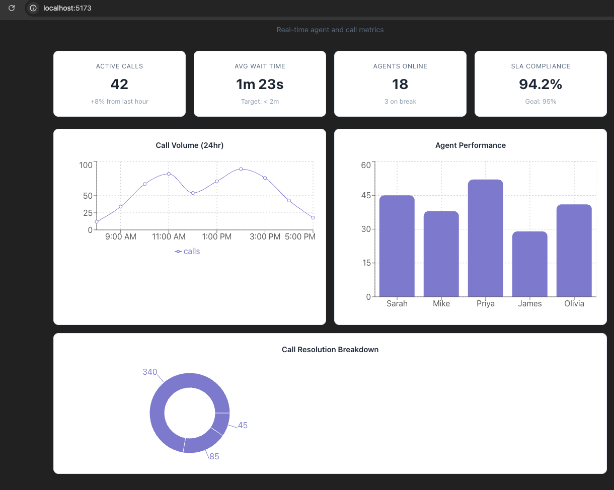
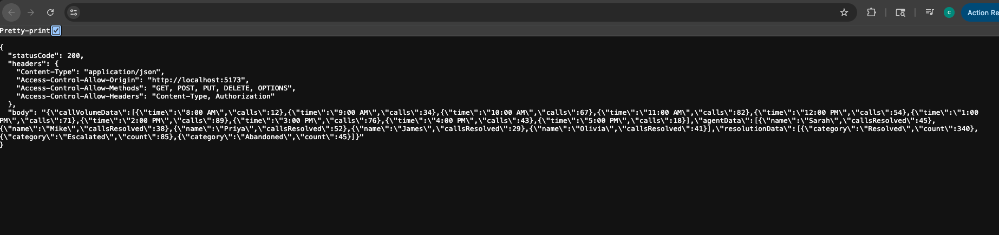

# Call Center Dashboard

A real-time call center analytics dashboard built with React, TypeScript, and AWS. Displays live call volume trends, agent performance metrics, and resolution breakdowns through interactive charts powered by a serverless backend.



## Architecture

```
React + TypeScript Frontend
        │
        ▼
   API Gateway (REST)
        │
        ▼
   AWS Lambda (Node.js)
        │
        ▼
   JSON Response
   ├── callVolumeData
   ├── agentData
   └── resolutionData
```



## Tech Stack

**Frontend:** React 19, TypeScript, Vite, Recharts

**Backend:** AWS Lambda (Node.js), API Gateway (REST)

**Key Features:**
- Responsive dashboard layout with CSS Grid
- Line chart tracking hourly call volume across a full workday
- Bar chart comparing agent resolution performance
- Donut chart visualizing call resolution categories (resolved, escalated, abandoned)
- Async data fetching with loading and error states
- CORS-configured serverless API
- Environment variable configuration for API endpoints

## Getting Started

### Prerequisites

- Node.js 18+
- npm

### Installation

```bash
git clone https://github.com/your-username/call-center-dashboard.git
cd call-center-dashboard
npm install
```

### Environment Setup

Create a `.env` file in the project root:

```
VITE_API_URL=https://your-api-gateway-url/prod/dashboard
```

### Run Locally

```bash
npm run dev
```

Open [http://localhost:5173](http://localhost:5173) in your browser.

## Project Structure

```
call-center-dashboard/
├── lambda/
│   └── index.mjs              # AWS Lambda handler
├── src/
│   ├── components/
│   │   ├── charts/
│   │   │   ├── CallLineChart.tsx    # Call volume line chart
│   │   │   ├── BarChart.tsx         # Agent performance bar chart
│   │   │   └── DonutChart.tsx       # Resolution breakdown donut chart
│   │   ├── Dashboard.tsx            # Main dashboard layout
│   │   └── Dashboard.css            # Dashboard styles
│   ├── data/
│   │   └── mockData.ts             # TypeScript interfaces + fallback data
│   ├── services/
│   │   └── api.ts                  # API fetch service
│   └── App.tsx
├── .env
├── .gitignore
└── package.json
```

## AWS Setup

### Lambda

The `lambda/index.mjs` function serves call center metrics as a JSON payload containing call volume time-series data, agent performance stats, and resolution breakdowns. Deployed on Node.js runtime with no external dependencies.

### API Gateway

REST API with a single `GET /dashboard` endpoint proxying to the Lambda function. CORS enabled for cross-origin frontend requests.